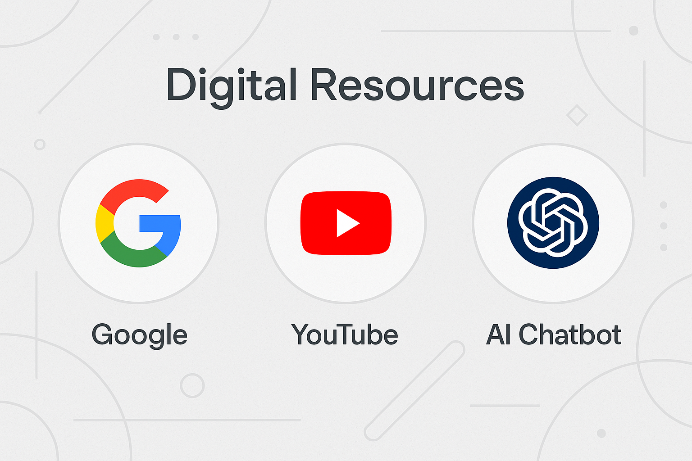

## 🧭 Parte 1 – Introduzione

Oggi le risorse digitali sono una grande opportunità per migliorare le lezioni.  
Ogni insegnante può imparare a **trovare e usare contenuti utili online** attraverso tre strumenti principali:

- **Google**, per cercare informazioni, schede, materiali educativi, idee per le lezioni e guide pratiche;
    
- **YouTube**, per guardare video tutorial, spiegazioni chiare e contenuti didattici per ogni materia;
    
- **Chatbot AI**, come ChatGPT o Gemini, per ricevere aiuto immediato nella preparazione di materiali, spiegazioni, giochi o esercizi.
    

👉 Combinando questi strumenti, possiamo:

- Cercare un argomento con Google → trovare video su YouTube → usare l’AI per creare attività o spiegazioni personalizzate;
    
- Chiedere all’AI di scrivere una guida → integrare immagini trovate con Google → mostrare in classe video selezionati da YouTube.
    

## 💡 Parte 2 – Spiegazione degli strumenti

### 🌐 **Google**

Google rimane uno degli strumenti più utili per:

- Trovare **schede, materiali, giochi didattici** (es. _“schede grammatica classe terza pdf”_);
    
- Cercare **siti e blog affidabili** (es. _Maestra Mary_, _La maestra Larissa_);
    
- Recuperare **guide e tutorial** (es. _“come usare Canva Salvatore Aranzulla”_).

---

### 🎥 **YouTube**

YouTube è ideale per:

- Mostrare **video didattici** già pronti (es. _“divisioni in colonna spiegazione bambini”_);
    
- Cercare **canali affidabili** (come _Maestra Agnese_, _Baby Professor_);
    
- **Creare playlist** di video per preparare lezioni più coinvolgenti;
    
- Imparare come **usare strumenti digitali** (es. Canva, Moduli Google).
    

---

### 🤖 **Chatbot AI (ChatGPT, Gemini, ecc.)**

Un assistente AI può:

- Scrivere idee o attività su richiesta (es. _“inventami un gioco per insegnare le frazioni”_);
    
- Fornire **manuali o spiegazioni rapide** su qualsiasi software;
    
- Adattare i contenuti a diversi livelli scolastici;
    
- Generare **quiz, verifiche, giochi**, pronti da stampare o usare online.
    

---

### 🔄 **Uso combinato degli strumenti**

- Tradurre un concetto in inglese con l’AI → trovare un video su YouTube in inglese → attivare sottotitoli in italiano.
    
- Trovare una risorsa non perfetta → chiedere all’AI di migliorarla o adattarla alla classe.
    
- Usare l’AI per **guidare la ricerca** di risorse su Google e YouTube in modo più veloce e mirato.
    
