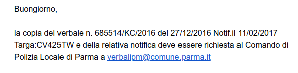

# Multa di Parma - Timeline degli eventi

## 27/12/2016 - Infrazione
### Verbale non in nostro possesso al momento

Pare che il 27/12/2016 sia stata commessa un'infrazione.
**Targa**: CV425TW
**Verbale**: 685514/KC/2016

Per avere il documento bisogna chiedere alla polizia locale di parma, come ci hanno comunicato nell'email del comune.

## 11/02/2017 - Notifica infrazione
### Verbale non in nostro possesso al momento

Questa è la data in cui risulta essere stata notificata l'infrazione.
**Spese**: 163€ di multa + 18,20 € di verbale = 181,20 €
**Verbale**: 685514/KC/2016

Per avere il documento penso anche per questo bisogna chiedere alla polizia locale di parma.

## 22/01/2018 - Firma di Ingiunzione di Pagamento
### Verbale in nostro possesso

L'atto dichiara che va effettuato il pagamento a 30 giorni dalla notifica, altrimenti sarà valutata l'opportuna azione esecutiva prevista dalla vigente normativa. Specifica inoltre che ciò significa un fermo amministrativo di beni mobili registrati.

**Spese**: 163€ di multa + 18,20€ di spese per il verbale + 17,01€ di spese per ingiunzione di pagamento = 198 € arrotondato per difetto
**Verbale**: 3697552

## 23/02/2018 - Mancata Ricezione della notifica entro 10 giorni e rilascio della multa nella cassetta delle lettere
### Notifica in nostro possesso

Nella notifica c'è scritto che dopo 10 giorni di tentativi non hanno trovato nessuno in casa e che hanno lasciato la lettera nella cassetta della posta. 

**Data partenza**: 03/02/2018
**Data avvenuto deposito**: 13/02/2018
**Data di mancato ritiro**: 23/02/2018

## 11/11/2022 - Intimidazione di pagamento
### Verbale in nostro possesso

Nel verbale avvisano che se il pagamento non avverrà entro 5 giorni dalla notifica dell'avviso daranno corso alle procedure cautelari previste dalla legge D.P.R. 29/09/1973 Nr. 602

**Spese**: 198€ dell'atto ingiuntivo + 24€ di intimazione pagamento = 222€
**Verbale**: 5191296

## 21/11/2022 - Maria Luisa firma l'avvenuta consegna
### Notifica in nostro possesso

Nella notifica c'è la firma di Maria Luisa.

**Data partenza**: 16/11/2022
**Data consegna**: 21/11/2022

## 27/02/2024 - Avviso di avvio procedura per fermo del veicolo
### Verbale in nostro possesso

Nel verbale si avvisa che se non si paga la cifra richiesta entro 30 giorni provvederanno al fermo del mezzo presso il Pubblico Registro Automobilistico dell'ACI.

**Spese**: 222€ della precedente intimazione + 50€ di sanzione = 285€
**Automobile**: DT254BM
**Verbale**: 5699314

## 05/03/2024 - Qualcuno firma l'avvenuta consegna
### Notifica in nostro possesso

Non riesco a riconoscere la firma ma qualcuno ha firmato e ritirato il verbale.

## 11/03/2025 - Ci confermano il fermo amministrativo
### Verbale in nostro possesso

In questo verbale confermano il fermo della macchina e sollecitano ad effettuare il pagamento entro 10 giorni dalla ricezione dell'atto. 

## Boh - non abbiamo ricevuto la notifica così l'hanno messa nella cassetta delle lettere
### Notifica non in nostro possesso

Ho proprio paura che la data di notifica è già oltre i 10 giorni. C'è da capire che succede ora.

